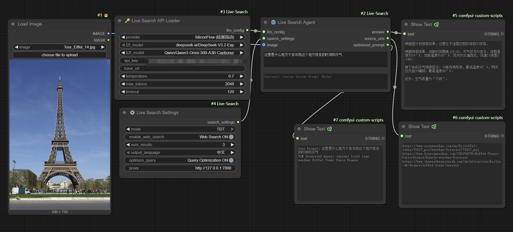
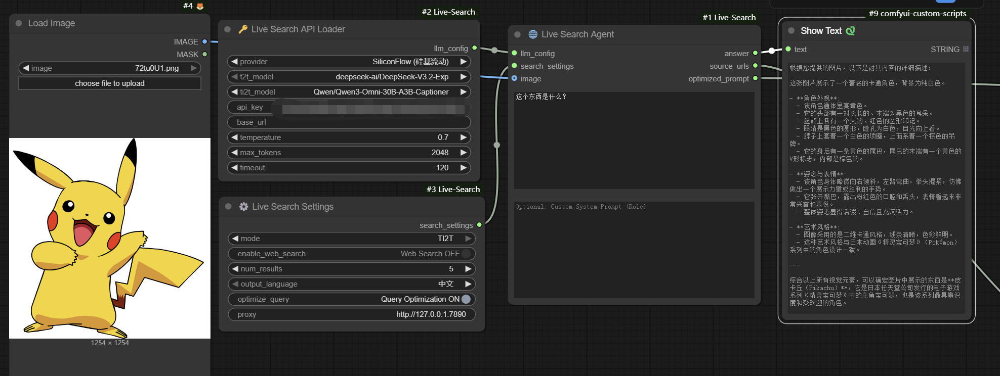
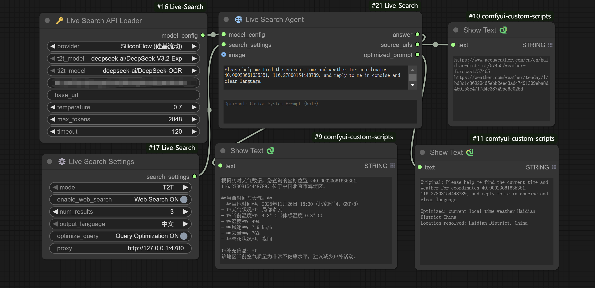

<div align="center">

# 🌐 Live Search - Real-time Web Search for ComfyUI

**Connect Your ComfyUI to the Internet | Search, Scrape, Summarize**

[](LICENSE)
[](https://www.python.org/)
[](https://github.com/Zone-Roam/ComfyUI-Live-Search)

**🔥 Use Cases**: Real-time Weather · News Summary · Fact Checking · Product Reviews · Web Scraping · GPS Coordinate Conversion

**🤖 Supported Models**: GPT-5.1 · DeepSeek-V3 · Gemini 3 Pro · Claude 4.5 · Qwen3 · Doubao · Llama 4 · Ollama

[中文文档](README_CN.md) | [English](README.md)

</div>

---

## 📖 Why Choose Live Search?

**ComfyUI Live Search** brings the internet directly to your workflows! This powerful **internet search node** provides:

✅ **Real-time Search**: DuckDuckGo search engine, stable and reliable  
✅ **AI Summarization**: Automatically reads web pages and extracts key information  
✅ **Multi-LLM Support**: GPT-5.1, DeepSeek-V3, Gemini 3 Pro, Claude 4.5, Qwen3, and 8+ LLM providers  
✅ **Modular Architecture**: Separated API config, search settings, and execution logic  
✅ **Chinese-Friendly**: Perfect support for Chinese LLM providers (Qwen, Doubao, DeepSeek)

**Typical Use Cases**:
- 🌤️ Query real-time weather to generate scene images
- 📰 Fetch latest news and generate related content
- 🔍 Fact checking and information verification
- 🛍️ Product information lookup and review summarization
- 📍 GPS coordinate to location conversion (e.g., "40.00023, 116.27808" → "Beijing, Haidian District")
- 💬 Pure LLM chat (disable web search for direct AI conversations)
- 🌐 Any creative workflow requiring internet information

## 🏗️ New Modular Architecture

**Inspired by [comfyui_LLM_party](https://github.com/heshengtao/comfyui_LLM_party)'s excellent design**, we adopt a **modular layered architecture**:

### 📊 Node Composition

```
🔑 API Loader → ⚙️ Settings → 🌐 Search Agent → Results
```

| Node | Function | Output |
|------|----------|--------|
| **🔑 Live Search API Loader** | API config & model selection | MODEL_CONFIG |
| **⚙️ Live Search Settings** | Search parameters | SEARCH_SETTINGS |
| **🌐 Live Search Agent** | Main search logic | answer, source_urls, optimized_prompt |

### ✅ New Architecture Benefits

- **Modular Design**: Separation of config and logic, easier to maintain
- **Reusability**: One API Loader can connect to multiple Agents
- **Flexibility**: Different Settings for different scenarios
- **Professional**: Best practices from large-scale projects

### 🔄 Backward Compatibility

- Legacy single-node `🌐 Live Search (Legacy)` still available
- New users recommended to use the new three-node combo

---

## ✨ Key Features

- **🔍 DuckDuckGo Search Engine**  
  Stable, proxy-friendly, no API key required. Perfect for real-time info retrieval and complements any LLM/VLM.
  
- **🧠 Multi-Provider Model Hub (Text & Vision)**  
  - **OpenAI**: GPT-5.x, GPT-4.1 family, GPT-4o (now fully TI2T-capable)  
  - **SiliconFlow**: DeepSeek, Qwen3/Qwen2.5 VL, GLM-4.5V, Qwen3-Omni, etc. (single provider covering 70+ CN models)  
  - **DeepSeek Official / Aliyun / Volcengine**, **Gemini (OpenAI-format)**, **Anthropic Claude**, **Qwen (Aliyun)**, **Grok**, **Doubao**, **Ollama (local)**  
  > ✅ Every provider is validated end-to-end (auth, payload, response parsing).

- **🖼️ Dual Mode: T2T & TI2T**  
  - **T2T**: Traditional text-only LLM flow with web search + summarization  
  - **TI2T**: Vision-language pipeline (prompt + IMAGE) for reverse image search, landmark recognition, document reading, etc.  
  - TI2T supports **web search + image context fusion** (two-stage VLM call) and is available for **OpenAI GPT-5.1 / GPT-4o families** & **SiliconFlow VLMs**.

- **🌦️ Structured Tooling**  
  - **Open-Meteo** integration for precise real-time weather/time when GPS coordinates are provided  
  - **geopy + Nominatim** reverse geocoding (lat/lon → city/country)  
  - **Query Optimization** (rename: `optimize_query`) improves English search keywords while keeping answers in your selected language  
  - **Conflict resolution** prompts ensure VLM trusts web data for up-to-date info (time, weather).

- **🈚 Multi-Language Output**  
  Explicit output control: **中文** or **English** (no more “Auto” surprises). System prompts enforce consistency for both LLM and VLM flows.

- **🔐 Cloud-Friendly Security**  
  API keys never persist to disk, `.env` + `api_config.json` supported, and per-node proxy keeps shared GPU rentals safe.

## 🧠 T2T vs TI2T Modes

| Mode | Inputs | Model Slot | Flow | Perfect For |
|------|--------|------------|------|-------------|
| **T2T (Text → Text)** | Prompt | `t2t_model` | Search (DuckDuckGo) → scrape trusted sources → inject Open-Meteo & geopy context → LLM summarization. | Weather/time, news, fact checking, research, pure LLM chat (disable web search). |
| **TI2T (Text + IMAGE → Text)** | Prompt + ComfyUI IMAGE tensor | `ti2t_model` | Encode image → VLM query generation → DuckDuckGo search → VLM final reasoning with image + search snippets. | Landmark recognition, “reverse image” info, screenshot comprehension, visual + real-time hybrid tasks. |

**Implementation Notes**
- API Loader now provides **independent `t2t_model` / `ti2t_model` dropdowns** per provider. Agent auto-selects based on Settings `mode`.
- TI2T currently supports **OpenAI GPT-5.1 / GPT-4o / GPT-4-turbo** and **SiliconFlow VLM lineups** (Qwen3-VL, Qwen3-Omni, GLM-4.5V, DeepSeek-VL2, etc.).
- TI2T keeps **web search optional**: when enabled, VLM runs twice (query generation + final answer) so image context stays synced with live data.
- Both modes reuse the unified **`MODEL_CONFIG`** output, so legacy workflows remain compatible.

#### OpenAI GPT-5.x usage notes
- Access to GPT-5.1 family still requires an OpenAI plan with GPT-5 privileges (Pro/Team/Enterprise). If the API returns 404/403, double-check your account permissions.
- Live Search automatically switches GPT-5.* calls to the **Responses API**. You do not need to edit the base URL; simply pick `gpt-5.1`, `gpt-5.1-mini`, `gpt-5`, `gpt-5-mini`, or `gpt-5-pro` in API Loader.
- The node maps `max_tokens` → OpenAI's `max_output_tokens` under the hood, so you can keep using the same control in the UI.
- TI2T (image + text) is currently validated for `gpt-5.1`, `gpt-5.1-mini`, `gpt-5`, `gpt-5-mini`, and `gpt-5-pro`. Older GPT-4 models stay available for backward compatibility.

## 🚀 Installation

### Method 1: via ComfyUI Manager (Recommended)

1. Open **Manager** panel in ComfyUI
2. Click **Install Custom Nodes**
3. Search for `Live Search`
4. Click **Install** and restart ComfyUI

### Method 2: Git Clone

Navigate to your ComfyUI `custom_nodes` directory and run:

```bash
git clone https://github.com/Zone-Roam/ComfyUI-Live-Search.git
cd ComfyUI-Live-Search

# If using Portable version of ComfyUI (Recommended)
..\..\..\python_embeded\python.exe -m pip install -r requirements.txt

# If using system Python or virtual environment
pip install -r requirements.txt
```

Then restart ComfyUI.

### Method 3: Manual Installation

1. Download the ZIP file
2. Extract it to `ComfyUI/custom_nodes/ComfyUI-Live-Search`
3. Install dependencies as shown in Method 2
4. Restart ComfyUI

## 🛠️ Usage Guide

### 📸 Demo Screenshots

| Screenshot | Scenario |
|------------|----------|
|  | **TI2T · Eiffel Tower + Web Search**: upload an Eiffel Tower photo, let GPT‑5.1 VLM generate `current local time weather Eiffel Tower Paris France`, run DuckDuckGo, and answer “这里是巴黎埃菲尔铁塔 … 当前温度 …”. |
|  | **TI2T · Cartoon Recognition**: feed a Pikachu image with prompt “这个东西是什么？”，VLM 模型在 `Web Search OFF` 下直接描述颜色、特征与动画背景。 |
|  | **T2T · GPS Weather Lookup**: text prompt “Please help me find the current time and weather for coordinates 40.00023661635351, 116.27808154448789...”，启用 web search 获取海淀区实时天气并输出中文摘要。 |

> Tip: mix and match Settings (mode, language, proxy) with different providers to recreate these flows or capture your own demos.

---

### Modular Node Workflow (Recommended) ⭐

#### **🔑 Live Search API Loader**

Configure LLM API and model parameters.

| Parameter | Description |
|-----------|-------------|
| **provider** | Choose provider: OpenAI, SiliconFlow, DeepSeek, Gemini, Anthropic, Qwen, Doubao, Ollama, etc. |
| **t2t_model** | Text-only model for T2T mode (LLM) |
| **ti2t_model** | Vision-language model for TI2T mode (VLM). Shows “No VLM models available” if the provider has none. |
| **api_key** | API key (optional, supports .env) |
| **base_url** | API endpoint (optional, falls back to provider defaults) |
| **temperature** | Temperature (0.0-2.0) |
| **max_tokens** | Maximum output length |
| **timeout** | Request timeout |

#### **⚙️ Live Search Settings**

Configure search behavior.

| Parameter | Description |
|-----------|-------------|
| **mode** | `T2T` (text) or `TI2T` (text + image). TI2T expects an IMAGE input on the Agent node. |
| **enable_web_search** | Enable/disable web search (OFF = use as pure LLM) |
| **num_results** | Number of search results (1-10) |
| **output_language** | Output language: `中文` or `English` |
| **optimize_query** | LLM-powered search keyword optimization (English-focused for better search recall) |
| **proxy** | Proxy address (optional) |

#### **🌐 Live Search Agent**

Main search node, connects to the above two nodes.

| Input | Type | Description |
|-------|------|-------------|
| **prompt** | STRING | Your question |
| **model_config** | MODEL_CONFIG | From API Loader |
| **search_settings** | SEARCH_SETTINGS | From Settings |
| *(optional)* **image** | IMAGE | Required when `mode = TI2T`. Pass any ComfyUI image tensor (RGB/RGBA). |
| *(optional)* **role** | STRING | Custom system prompt injected before the default instructions. |

| Output | Description |
|--------|-------------|
| **answer** | AI-generated answer |
| **source_urls** | Referenced source links |
| **optimized_prompt** | Optimized search query |

---

## 🔍 Why Only DuckDuckGo?

This node uses **real web scraping** for search, not API calls. In our testing:

**✅ DuckDuckGo Advantages**:
- Automation-friendly with lenient anti-bot measures
- Works reliably even with proxy configuration
- Search quality fully meets real-time information retrieval needs
- Open-source friendly with strong community support

**❌ Google Issues**:
- Extremely strict anti-scraping mechanisms (CAPTCHAs, IP blocks, User-Agent detection)
- Often returns empty results or CAPTCHA pages even with proxies
- `googlesearch-python` library is unstable in production
- Frequent access leads to temporary IP bans

**💡 If You Need Google Search Quality**:
- Consider using official **Google Custom Search API** (paid)
- Or use third-party services like **SerpAPI** (paid)

We chose DuckDuckGo to ensure the node works **reliably** across all environments.

---

## ⚙️ Configuration (Optional)

For local users who don't want to paste their API key every time, there are two configuration methods:

### Method 1: Use .env File (Recommended) ⭐

1. Copy `.env.example` to `.env`
2. Edit `.env` and fill in your API keys:

```bash
OPENAI_API_KEY=sk-your-openai-key-here
DEEPSEEK_OFFICIAL_API_KEY=sk-your-deepseek-key-here
```

**Advantages**:
- ✅ Industry standard practice
- ✅ Automatically excluded by `.gitignore`, won't be accidentally committed
- ✅ More secure and professional

### Method 2: Use api_config.json

1. Rename `api_config_example.json` to `api_config.json`
2. Edit and fill in your API keys:

```json
{
    "openai_api_key": "sk-...",
    "deepseek (official)_api_key": "sk-..."
}
```

### API Key Priority

```
Node Input (Highest) > .env File > api_config.json (Lowest)
```

> **Note**: On cloud platforms, always use the `api_key` widget in the node for security.

## 📄 License

Apache 2.0 License
